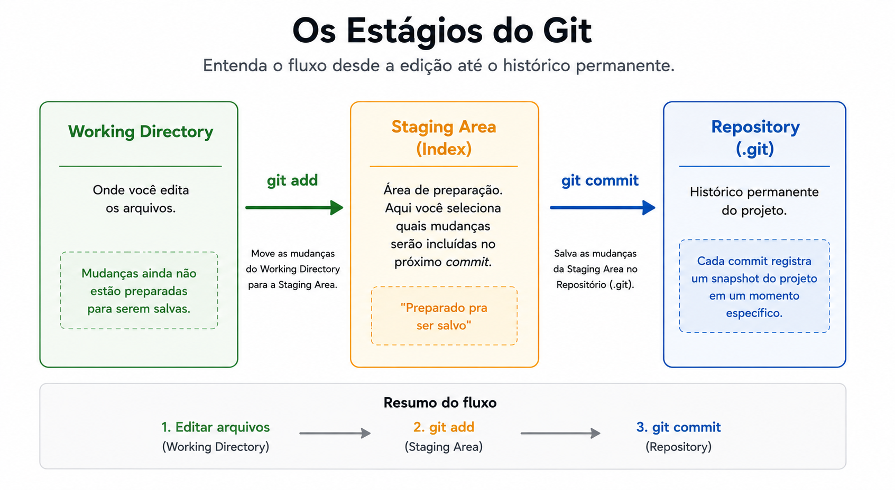
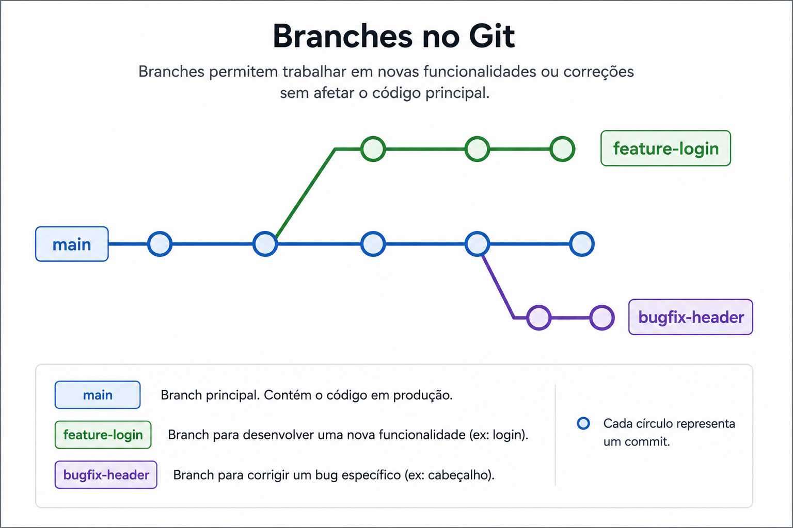

# 🚀 Git

> **Objetivo:** Ao final desta aula, você vai entender o que é Git, por que ele é importante, e vai saber usar os comandos essenciais para versionar seus projetos e colaborar com outras pessoas usando GitHub.

---

## 📋 Sumário

1. [Introdução: Por que Git existe?](#módulo-1--introdução-por-que-git-existe)
2. [Git vs GitHub: qual a diferença?](#módulo-2--git-vs-github-qual-a-diferença)
3. [Instalação e configuração inicial](#módulo-3--instalação-e-configuração-inicial)
4. [Conceitos fundamentais](#módulo-4--conceitos-fundamentais)
5. [Primeiros comandos na prática](#módulo-5--primeiros-comandos-na-prática)
6. [Trabalhando com branches](#módulo-6--trabalhando-com-branches)
7. [Conectando com o GitHub](#módulo-7--conectando-com-o-github)
8. [GitHub Flow: o fluxo de trabalho](#módulo-8--github-flow-o-fluxo-de-trabalho)
9. [Pull Requests, Issues e Forks](#módulo-9--pull-requests-issues-e-forks)
10. [Markdown no GitHub](#módulo-10--markdown-no-github)
11. [Boas práticas](#módulo-11--boas-práticas)

---

## Módulo 1 — Introdução: Por que Git existe?

### A dor que o Git resolve

Imagina a seguinte situação: você está escrevendo um trabalho da faculdade e salva assim:

```sh
trabalho.docx
trabalho_v2.docx
trabalho_v2_FINAL.docx
trabalho_v2_FINAL_AGORA_VAI.docx
trabalho_v2_FINAL_AGORA_VAI_revisado.docx
```

Bagunça, né? Agora imagina isso em um projeto com **milhares** de arquivos e **várias pessoas** mexendo ao mesmo tempo. Vira um caos.

**Git é um Sistema de Controle de Versão (VCS)** que resolve esse problema. Ele:

- 📜 Guarda o histórico completo de todas as alterações
- ⏪ Permite voltar para qualquer versão anterior
- 👥 Permite que várias pessoas trabalhem no mesmo projeto sem pisar no pé umas das outras
- 🔀 Junta o trabalho de todo mundo em uma versão final
- 🧪 Permite experimentar mudanças sem medo de quebrar o que já funciona

### Um pouco de história

O Git foi criado em 2005 pelo Linus Torvalds (o mesmo criador do Linux) para gerenciar o desenvolvimento do kernel do Linux. Hoje é o sistema de controle de versão mais usado no mundo.

---

## Módulo 2 — Git vs GitHub: qual a diferença?

Essa é uma confusão clássica. Vamos esclarecer:

| Git | GitHub |
| ----- | -------- |
| É um **programa** que roda no seu computador | É um **site/serviço** na internet |
| Funciona offline | Precisa de internet |
| Cuida do controle de versão | Hospeda seus repositórios Git online |
| Foi criado em 2005 | Foi criado em 2008 |
| Gratuito e open source | Plataforma com versão gratuita e paga |

**Analogia simples:** Git é como o Microsoft Word (programa que roda no seu PC). GitHub é como o Google Drive (lugar online onde você guarda e compartilha seus arquivos). Eles trabalham juntos, mas são coisas diferentes.

Existem alternativas ao GitHub, como **GitLab** e **Bitbucket**, mas o GitHub é o mais popular.

---

## Módulo 3 — Instalação e configuração inicial

### Instalando o Git

**Windows:** Baixe em [git-scm.com](https://git-scm.com/download/win) e instale com as opções padrão.

**Mac:** Abra o Terminal e digite:

```bash
git --version
```

Se não tiver instalado, o Mac vai sugerir instalar via Xcode Command Line Tools. Aceite.

**Linux (Ubuntu/Debian):**

```bash
sudo apt update
sudo apt install git
```

### Verificando se deu certo

Em qualquer sistema, abra o terminal e rode:

```bash
git --version
```

Você deve ver algo como `git version 2.43.0`.

### Configuração inicial (faça isso só uma vez!)

O Git precisa saber quem é você para registrar suas alterações:

```bash
git config --global user.name "Seu Nome"
git config --global user.email "seu.email@exemplo.com"
```

⚠️ **Importante:** Use o mesmo e-mail que você vai usar no GitHub.

Outras configurações úteis:

```bash
# Define o editor padrão (opcional)
git config --global core.editor "code --wait"   # VS Code
git config --global core.editor "nano"          # Nano

# Define o nome da branch principal como "main"
git config --global init.defaultBranch main

# Ver todas as configurações
git config --list
```

---

## Módulo 4 — Conceitos fundamentais

Antes de digitar comandos, precisamos entender alguns conceitos. **Sem isso, Git parece magia. Com isso, faz total sentido.**

### Repositório (repo)

É a **pasta do seu projeto** que está sendo monitorada pelo Git. Pense nisso como uma pasta especial que tem "superpoderes" para guardar histórico.

### Os três estados de um arquivo

Todo arquivo no Git passa por três áreas:



1. **Working Directory:** sua pasta de trabalho, onde você edita os arquivos normalmente.
2. **Staging Area:** uma "área de preparo" onde você escolhe quais alterações vão entrar no próximo commit.
3. **Repository:** o histórico permanente. Uma vez aqui, fica registrado para sempre.

### Commit

Um **commit** é como uma **fotografia** do seu projeto naquele momento. Cada commit tem:

- Um identificador único (hash, tipo `a1b2c3d`)
- Um autor
- Uma data
- Uma mensagem explicando o que mudou
- O conteúdo dos arquivos naquele momento

### Branch (ramificação)

Uma branch é uma **linha de desenvolvimento independente**. A branch principal geralmente se chama `main` (antigamente `master`). Você pode criar outras branches para testar coisas sem mexer na principal.



### HEAD

`HEAD` é um "ponteiro" que indica em qual commit você está no momento. Normalmente aponta para o último commit da branch atual.

---

## Módulo 5 — Primeiros comandos na prática

Vamos colocar a mão na massa! Abra seu terminal.

### Criando seu primeiro repositório

```bash
# Cria uma pasta nova
mkdir meu-primeiro-repo
cd meu-primeiro-repo

# Inicia o Git nessa pasta
git init
```

Pronto! Essa pasta agora é um repositório Git. O Git criou uma pasta oculta `.git` que guarda toda a mágica.

### Criando um arquivo e vendo o status

```bash
# Cria um arquivo de texto
echo "# Meu Primeiro Projeto" > README.md

# Vê o que tá rolando
git status
```

O `git status` é seu melhor amigo. Use ele **o tempo todo**. Ele vai te dizer:

- Em qual branch você está
- Quais arquivos foram modificados
- O que está na staging area
- O que ainda não foi adicionado

### Adicionando arquivos (staging)

```bash
# Adiciona um arquivo específico
git add README.md

# Adiciona todos os arquivos modificados
git add .

# Adiciona apenas arquivos .js (por exemplo)
git add *.js
```

### Fazendo seu primeiro commit

```bash
git commit -m "Primeiro commit: criando o README"
```

A flag `-m` é a mensagem do commit. **Sempre escreva mensagens descritivas!**

### Vendo o histórico

```bash
# Histórico completo
git log

# Versão resumida (uma linha por commit)
git log --oneline

# Com gráfico das branches
git log --oneline --graph --all
```

Para sair do `git log`, aperte `q`.

### Vendo o que mudou

```bash
# Mostra mudanças não adicionadas ao staging
git diff

# Mostra mudanças que estão no staging
git diff --staged
```

### Desfazendo coisas

```bash
# Tira um arquivo do staging (mas mantém as mudanças)
git restore --staged arquivo.txt

# Descarta mudanças não commitadas (CUIDADO! Não tem volta)
git restore arquivo.txt

# Altera a mensagem do último commit
git commit --amend -m "Nova mensagem"
```

### 🧪 Exercício prático 1

Faça o seguinte:

1. Crie uma pasta chamada `exercicio-git`
2. Inicie um repositório Git nela
3. Crie um arquivo `sobre-mim.md` com algumas informações suas
4. Faça um commit com a mensagem "Adiciona arquivo sobre mim"
5. Adicione mais informações no arquivo
6. Faça outro commit
7. Rode `git log` e veja seu histórico

---

## Módulo 6 — Trabalhando com branches

Branches são o coração do trabalho colaborativo. Vamos aprender a usá-las.

### Por que usar branches?

Imagina que você está num projeto que já funciona em produção. Você quer adicionar uma nova feature, mas tem medo de quebrar tudo. Solução: cria uma branch nova, mexe à vontade, e só quando estiver tudo certo você junta com a branch principal.

### Comandos essenciais de branch

```bash
# Lista todas as branches (a com asterisco é a atual)
git branch

# Cria uma branch nova
git branch nome-da-branch

# Muda para uma branch
git checkout nome-da-branch

# Cria E muda para uma branch (atalho)
git checkout -b nova-feature

# Versão mais nova dos comandos acima
git switch nome-da-branch
git switch -c nova-feature

# Deleta uma branch
git branch -d nome-da-branch
```

### Juntando branches (merge)

```bash
# Primeiro, vá para a branch que vai RECEBER as mudanças
git checkout main

# Depois, faça o merge da outra branch
git merge nova-feature
```

### Conflitos de merge

Às vezes, duas branches mexem na mesma linha do mesmo arquivo. Aí o Git não sabe qual versão usar e gera um **conflito**. Quando isso acontece, o arquivo fica assim:

```git
<<<<<<< HEAD
Texto da branch atual
=======
Texto da outra branch
>>>>>>> nova-feature
```

Você precisa:

1. Abrir o arquivo
2. Decidir qual versão manter (ou misturar as duas)
3. Apagar os marcadores `<<<<<<<`, `=======` e `>>>>>>>`
4. Salvar o arquivo
5. Rodar `git add arquivo.txt` e `git commit`

**Não entre em pânico com conflitos!** Eles são normais e fazem parte do trabalho colaborativo.

### 🧪 Exercício prático 2

1. No seu repositório, crie uma branch chamada `experimento`
2. Mude para ela
3. Modifique o arquivo e faça um commit
4. Volte para a `main`
5. Note que o arquivo voltou ao estado anterior (mágico, né?)
6. Faça o merge da branch `experimento` na `main`

---

## Módulo 7 — Conectando com o GitHub

Até agora, tudo aconteceu no seu computador. Hora de colocar seu código no GitHub.

### Criando conta no GitHub

1. Vá em [github.com](https://github.com)
2. Clique em "Sign up"
3. Use o **mesmo e-mail** que você configurou no Git
4. Escolha um nome de usuário (vai aparecer no seu perfil público!)

### Configurando autenticação

O GitHub não aceita mais login por senha via terminal. Você precisa usar uma das opções:

**Opção 1: Personal Access Token (PAT)** — mais simples

1. No GitHub: Settings → Developer settings → Personal access tokens → Tokens (classic)
2. Generate new token, marque os escopos `repo` e `workflow`
3. Copie o token (você só vê uma vez!)
4. Quando o Git pedir senha, cole o token

**Opção 2: Chave SSH** — mais segura e prática a longo prazo

```bash
# Gera uma chave SSH
ssh-keygen -t ed25519 -C "seu.email@exemplo.com"

# Mostra a chave pública (vai copiar isso)
cat ~/.ssh/id_ed25519.pub
```

Depois, no GitHub: Settings → SSH and GPG keys → New SSH key, e cola a chave.

### Criando um repositório no GitHub

1. No GitHub, clique no `+` no canto superior direito → "New repository"
2. Dê um nome
3. Escolha público ou privado
4. **NÃO** marque "Initialize with README" se você já tem um repo local (vai dar conflito)
5. Clique em "Create repository"

### Conectando o repo local ao GitHub

O GitHub vai te mostrar comandos parecidos com estes:

```bash
# Adiciona o repositório remoto
git remote add origin https://github.com/seu-usuario/seu-repo.git

# Renomeia a branch para main (se necessário)
git branch -M main

# Envia o código para o GitHub
git push -u origin main
```

A flag `-u` define o "upstream", então nos próximos pushes você só precisa rodar `git push`.

### Os principais comandos remotos

```bash
# Envia commits locais para o GitHub
git push

# Baixa as mudanças do GitHub e já faz merge
git pull

# Só baixa as mudanças, sem fazer merge (mais seguro)
git fetch

# Lista os repositórios remotos configurados
git remote -v

# Clona um repositório do GitHub para o seu computador
git clone https://github.com/usuario/repositorio.git
```

### Diferença entre `pull` e `fetch`

- `git fetch`: baixa as mudanças mas **não aplica** no seu código.
- `git pull`: baixa **e aplica** as mudanças (= `git fetch` + `git merge`).

`pull` é mais rápido, `fetch` é mais seguro porque te deixa revisar antes.

---

## Módulo 8 — GitHub Flow: o fluxo de trabalho

O **GitHub Flow** é o jeito mais comum de trabalhar com Git + GitHub em equipe. Funciona assim:

```sh
1. Crie uma branch a partir da main
        ↓
2. Faça commits na sua branch
        ↓
3. Abra um Pull Request
        ↓
4. Discuta e revise o código
        ↓
5. Faça merge na main
        ↓
6. Delete a branch
```

### Em comandos

```bash
# 1. Garante que está na main e atualizada
git checkout main
git pull

# 2. Cria uma branch nova
git checkout -b feature/login

# 3. Faz suas alterações e commita
git add .
git commit -m "Adiciona tela de login"

# 4. Envia a branch para o GitHub
git push -u origin feature/login

# 5. No GitHub, abre um Pull Request

# 6. Depois do merge, atualiza local e apaga a branch
git checkout main
git pull
git branch -d feature/login
```

---

## Módulo 9 — Pull Requests, Issues e Forks

### Pull Request (PR)

Um **Pull Request** é um pedido para juntar suas mudanças no projeto principal. É onde acontece a **revisão de código**.

Num PR você pode:

- 📝 Explicar o que você fez e por quê
- 👥 Adicionar revisores específicos
- 💬 Discutir as mudanças linha por linha
- ✏️ Fazer ajustes baseados no feedback
- ✅ Marcar tarefas concluídas
- 🔗 Linkar com issues relacionadas

### Issues

**Issues** são tickets para rastrear tarefas, bugs e ideias. Você usa para:

- 🐛 Reportar bugs
- 💡 Sugerir features
- 📌 Organizar tarefas
- ❓ Tirar dúvidas em projetos open source

Você pode **linkar PRs a issues** escrevendo `Closes #42` na descrição do PR. Aí quando o PR é mergeado, a issue fecha automaticamente. ✨

### Fork

Um **fork** é uma cópia de um repositório de outra pessoa, na sua conta. Usado quando você quer contribuir com um projeto que não é seu (típico em open source).

Fluxo de contribuição open source:

```sh
1. Fork do repo original
     ↓
2. Clone do SEU fork pro seu PC
     ↓
3. Cria branch e faz alterações
     ↓
4. Push pra SEU fork
     ↓
5. Abre Pull Request do SEU fork pro repo ORIGINAL
     ↓
6. Mantenedor revisa e (se aprovar) mergeia
```

---

## Módulo 10 — Markdown no GitHub

O GitHub usa **Markdown** para formatar READMEs, issues, PRs e comentários. É bem fácil:

```markdown
# Título grande
## Subtítulo
### Título menor

**negrito**
*itálico*
~~riscado~~

- Item de lista
- Outro item
  - Sub-item

1. Lista numerada
2. Segundo item

[Link clicável](https://github.com)


`código inline`

​```javascript
// bloco de código com syntax highlighting
console.log("oi");
​```

> Citação

| Coluna 1 | Coluna 2 |
| ---------- | ---------- |
| Valor 1  | Valor 2  |

- [x] Tarefa concluída
- [ ] Tarefa pendente
```

### README: o cartão de visita do seu projeto

Todo repositório deveria ter um `README.md` explicando:

- O que o projeto faz
- Como instalar
- Como usar
- Como contribuir
- Licença

### README de perfil

Você pode criar um README especial que aparece no seu **perfil do GitHub**. Para isso, crie um repositório com o **mesmo nome do seu usuário** e adicione um `README.md` nele. Esse é seu cartão de visita público!

---

## Módulo 11 — Boas práticas

### Mensagens de commit

✅ **Bom:**

```txt
Adiciona validação de e-mail no formulário de cadastro
Corrige bug que travava o app ao abrir tela de perfil
Refatora componente Header para usar hooks
```

❌ **Ruim:**

```txt
mudanças
atualização
fix
asdfgh
```

**Convenção comum (Conventional Commits):**

```txt
feat: nova funcionalidade
fix: correção de bug
docs: mudança em documentação
style: formatação, sem mudança de lógica
refactor: refatoração de código
test: adição/correção de testes
chore: tarefas de manutenção
```

Exemplo: `feat: adiciona login com Google`

### Commits pequenos e frequentes

Faça **commits pequenos e focados**. Um commit = uma ideia. Isso facilita:

- Entender o histórico
- Reverter mudanças específicas
- Revisar código em PRs

### .gitignore

Crie um arquivo `.gitignore` na raiz do projeto para o Git **ignorar** arquivos que não devem ser versionados:

```txt
# Dependências
node_modules/
vendor/

# Arquivos de ambiente (segredos!)
.env
.env.local

# Arquivos do sistema
.DS_Store
Thumbs.db

# Editores
.vscode/
.idea/

# Build
dist/
build/
*.log
```

⚠️ **NUNCA** commite senhas, tokens ou chaves de API! Use variáveis de ambiente e adicione `.env` no `.gitignore`.

### Pull antes de push

Sempre rode `git pull` antes de `git push` para evitar conflitos:

```bash
git pull
# (resolve conflitos se houver)
git push
```

### Nomeie branches de forma clara

```txt
feature/login-google
bugfix/header-quebrado-mobile
hotfix/erro-pagamento-producao
docs/atualiza-readme
```

## 🎓 Próximos passos

Quando você dominar o básico, dá pra ir mais fundo:

- **Comandos avançados:** `rebase`, `cherry-pick`, `stash`, `reflog`, `bisect`
- **GitHub Actions:** automação e CI/CD
- **Git hooks:** rodar scripts em momentos específicos
- **Submódulos:** projetos dentro de projetos
- **Estratégias de branching:** Git Flow, Trunk-Based Development
- **Contribuir para projetos open source**

### Recursos extras

- 📘 [Pro Git Book (grátis e em português)](https://git-scm.com/book/pt-br/v2)
- 🎮 [Learn Git Branching (jogo interativo)](https://learngitbranching.js.org/?locale=pt_BR)
- 📚 [GitHub Docs](https://docs.github.com/pt)
- 🎯 [Oh Shit, Git!?!](https://ohshitgit.com/pt) — como sair de enrascadas
